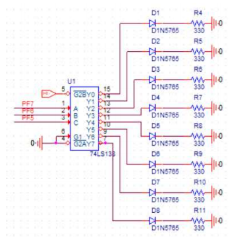

# SVM_with_AVR
1. PC 
  - License plate detection using OpenCV, Mnist SVM
  - Transmitting license plate numbers to AVR using UART

2. AVR
  - Weather forecasting using SVM
  - Print license plate and precipitation probability with 7 segment

3. External Circuit
  - Model parking lot implementation
  - 
